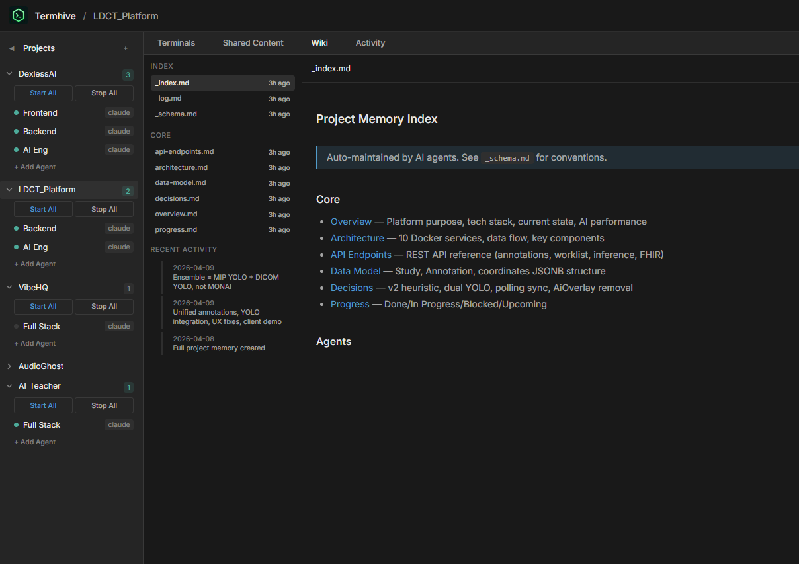
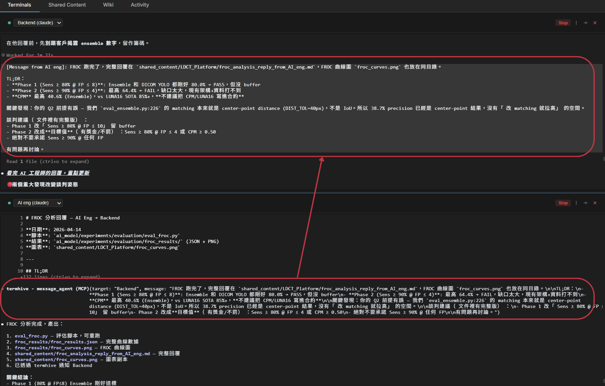

# Termhive

**The human-driven multi-agent dashboard.**

Termhive is a web-based control center for coding CLI agents (Claude Code, Codex, Gemini, OpenCode). While autonomous agent platforms hand the steering wheel to AI, Termhive keeps you in the driver's seat: see every agent's screen in one window, coordinate them manually, and intervene the moment something goes sideways.

Think of it as **tmux for coding agents** — with a web UI, project wiki, shared content, and MCP-based agent messaging.

https://github.com/user-attachments/assets/8c95c54b-5c1e-471e-9411-6150993b886b

## Why "human-driven"?

Autonomous agents are seductive in a demo. In practice they drift, burn tokens, and silently break things. I shipped two autonomous-agent harnesses before this one — both worked until they didn't, and the "didn't" was expensive to clean up.

Termhive is the opposite bet. You run 2–7 agents in parallel, each doing real work, but **you stay in the loop on every one**. No hidden decisions, no runaway loops, no "come back tomorrow and hope it went well."

### The problems it actually solves

- **Too many terminal windows** — can't find which agent is doing what
- **No easy way to share context** between agents working on the same project
- **No persistent project knowledge** — agents forget everything between sessions
- **No cross-agent coordination** — you end up copy-pasting between windows
- **Can't manage agents from mobile / remote** — you're stuck at your desk
- **Autonomous tools hide too much** — when they go wrong, you find out too late

Termhive gives you a browser-based dashboard, a per-project wiki, shared content folders, and native agent-to-agent messaging — all while you stay in control of every prompt.

## Features

- **Multi-vendor** — Claude Code, Codex CLI, Gemini CLI, OpenCode in one UI
- **Project organization** — Group agents by project, each with its own config
- **Terminal streaming** — Real xterm.js terminals with live PTY via WebSocket
- **Five terminal layouts** — Single, 2-up, 3-up, **Grid** (tmux-style recursive splits with per-pane split/close + drag-to-swap + draggable dividers), and **Canvas** (free-form drag & 8-way resize, positions persist per project)
- **Command palette** — `⌘K` / `Ctrl+K` to jump to agents, switch layouts, change theme, run batch actions. `⌘1–5` / `Ctrl+1-5` instantly focuses agent *N* (keeps working even when the terminal has focus).
- **Collapsible, resizable sidebar** — Drag the right edge (180–420px), or hit the toggle to hide it completely
- **4 themes** — Dark, Light, Amber Hive, Monochrome. Claude Code ANSI palette matched for both light and dark.
- **Shared content** — Centralized file store with auto `--add-dir` / `--include-directories` for all supported CLIs. Folder tree + editor in the UI.
- **Agent messaging** — Agents in the same project can message each other via MCP. Tell one agent "notify backend I'm done" and the message appears in the backend agent's terminal. Dedicated **Messages** tab shows the thread history with a composer.
- **Project Wiki** — Persistent wiki per project, inspired by [Karpathy's LLM Wiki](https://gist.github.com/karpathy/442a6bf555914893e9891c11519de94f) pattern
- **Activity feed** — Real-time file watcher on shared content + agent lifecycle + message events, grouped by day with filter chips
- **Per-agent color identity** — Deterministic hue + monogram for every agent so five panes are never a sea of sameness
- **Auto instruction files** — Generates `CLAUDE.md` / `AGENTS.md` in each agent's cwd with shared content, wiki, and teammate paths
- **Agent flags** — `--dangerously-skip-permissions` (Claude/OpenCode), `--remote-control` (Claude)
- **Start/Stop All** — Batch control per project
- **Usage monitor** — Claude & Codex rate limit tracking (session + week) in sidebar
- **Mobile responsive** — Slide-out sidebar, bottom agent tab bar, collapsible panels
- **Phone quick dock** — Direct Projects, Snippets, Local Shell, SSH, Keeper, and Settings actions
- **Command snippets** — Persistent reusable commands, project-scoped or global, sent to the focused terminal with one tap
- **Local shell terminals** — Keep normal Bash/tmux sessions beside coding agents
- **Saved SSH terminals** — Key-based SSH profiles with port, identity file, keepalive, and optional startup command
- **Real sign-in screen** — Username/password session login protects the UI, API, and WebSocket; Basic Auth remains available for automation
- **Lightweight** — JSON file storage, no database needed

### Hive Dashboard (v2 redesign)

The current UI is built around multi-agent panoramic viewing — **Grid** and **Canvas** modes are the differentiators:

- **Grid** is a recursive split tree. Hover any pane to reveal split-right / split-down / close buttons. Every split has a live resize divider. Drag one pane's header onto another to swap their agents in-tree. Tree state persists per project.
- **Canvas** is free-form. Drag any card's header to reposition; drag any of 8 edges/corners to resize. Each card has its own z-index (click to bring to front). Positions persist per project. A "Tile" button in the toolbar auto-arranges everything into a grid.

All layouts (2-up / 3-up / Grid / Canvas) use pointer `movementX/Y` deltas and real container widths for resize math, so they feel precise regardless of display scale.

## Quick Start

```bash
git clone https://github.com/0x0funky/TermHive.git
cd TermHive
npm install
npm run dev
```

Open `http://localhost:5173` in your browser.

### Prerequisites

- Node.js 20+
- `node-pty` requires native build tools:
  - **Windows**: `npm install -g windows-build-tools` or install Visual Studio Build Tools
  - **macOS**: `xcode-select --install`
  - **Linux**: `sudo apt install build-essential`

### Production

```bash
npm run build
AGENT_ORG_AUTH='admin:use-a-long-random-password' npm start
```

Server runs on `http://localhost:3200` (serves both API and frontend).

Production environment variables:

| Variable | Default | Purpose |
|----------|---------|---------|
| `HOST` | `0.0.0.0` | Web bind address |
| `PORT` | `3200` | Web/API/WebSocket port |
| `TERMHIVE_DAEMON_PORT` | `3210` | Local daemon port |
| `AGENT_ORG_AUTH` | unset | Login credentials as `username:password`; protects the UI, API, and WebSocket with an HttpOnly session cookie. Basic Auth remains accepted for scripts. |

Do not expose TermHive outside localhost or a trusted LAN without
`AGENT_ORG_AUTH` or an authenticated reverse proxy. The dashboard can type
directly into agent terminals and should be treated like shell access.

For phone access, the recommended deployment is
[Tailscale HTTPS](deploy/systemd/README.md). It avoids router port forwarding
and keeps terminal traffic inside an encrypted Tailnet.

## Project Wiki



A persistent, structured wiki per project — inspired by [Karpathy's LLM Wiki](https://gist.github.com/karpathy/442a6bf555914893e9891c11519de94f) pattern. Instead of agents rediscovering project context from scratch every session, they read and maintain a living wiki.

### How it works

1. Click **Wiki** tab → **Initialize Wiki** to create the wiki structure
2. Tell an agent to read the wiki:
   ```
   Read the project wiki's _index.md to understand the current project state
   ```
3. After an agent completes work, tell it to update the wiki:
   ```
   Update the project wiki with what you just did — follow _schema.md conventions
   ```
4. The agent reads `_schema.md` for maintenance rules, updates relevant pages, appends to `_log.md`, and updates `_index.md`

### Wiki structure

```
~/.termhive/wiki/[project-name]/
├── _schema.md          # Wiki maintenance rules (ingest/query/lint operations)
├── _index.md           # Page directory with one-line summaries
├── _log.md             # Chronological change log (append-only)
├── overview.md         # Project purpose, tech stack, current state
├── architecture.md     # System design, components, data flow
├── api-endpoints.md    # API reference with request/response formats
├── data-model.md       # Database schema and relationships
├── decisions.md        # Architecture decision records (append-only)
├── progress.md         # Done / In Progress / Blocked / Upcoming
├── agents/             # Per-agent work logs
└── raw/                # Immutable source documents
```

### Key principles

- **Human directs, LLM does the grunt work** — You decide when to update the wiki, agents handle the cross-referencing, indexing, and bookkeeping
- **Wiki is separate from Shared Content** — Shared content is for real-time file exchange between agents; Wiki is for long-term project knowledge
- **Agents access wiki automatically** — When an agent starts, the wiki directory is passed via `--add-dir`, and `CLAUDE.md`/`AGENTS.md` includes instructions to read `_index.md` on session start

## Shared Content

Shared content files are stored in `~/.termhive/shared_content/[project-name]/`. When an agent starts, the directory is automatically passed to the CLI:

| CLI | Flag | Instruction File |
|-----|------|-----------------|
| Claude Code | `--add-dir` | `CLAUDE.md` |
| Codex CLI | `--add-dir` | `AGENTS.md` |
| Gemini CLI | `--include-directories` | `AGENTS.md` |
| OpenCode | via `AGENTS.md` | `AGENTS.md` |

Instruction files are auto-generated in each agent's working directory with paths to both shared content and wiki.

All agents can read/write shared files, and the Termhive web UI reflects changes in real-time via file watching.

## Agent Messaging



Agents in the same project can send messages to each other. When you ask one agent to notify a teammate, it calls an MCP tool that delivers the message to the recipient's terminal as if the user had typed it.

### How it works

1. When an agent starts, Termhive registers a session-scoped MCP server exposing two tools: `message_agent(target, message)` and `list_teammates()`.
2. `CLAUDE.md` / `AGENTS.md` is auto-updated with a **Teammates** section listing other agents in the project (names, CLIs, roles).
3. When you say something like *"tell backend the API is done"*, the agent maps it to `message_agent(target="backend", message="API is done")`.
4. Termhive writes the message into the target agent's PTY as `[Message from Frontend]: API is done`, so the target's LLM sees it as fresh user input.

### Example

Talking to the Frontend agent:

```
> Tell backend the auth flow is complete, the spec is in shared/auth-spec.md

[Frontend uses message_agent tool]
→ Message delivered to backend.
```

Backend's terminal automatically receives:

```
[Message from Frontend]: the auth flow is complete, the spec is in shared/auth-spec.md
```

### Supported CLIs

| CLI | MCP Support | Mechanism |
|-----|-------------|-----------|
| Claude Code | ✅ | `--mcp-config <path>` flag (session-scoped, does not touch `~/.claude.json`) |
| Codex CLI | ✅ | Per-agent entry in `~/.codex/config.toml` keyed by agent id |
| Gemini CLI | ❌ | Not yet — no stable user-level MCP config |
| OpenCode | ❌ | Not yet |

### Design notes

- **Session-scoped, no global pollution** — Claude agents get a per-agent MCP config file at `~/.termhive/mcp-configs/<agentId>.json`. Your personal MCP setup in `~/.claude.json` is never modified.
- **Fuzzy addressing** — Target match is case-insensitive and falls back to partial name/role matching, so *"tell the backend"* resolves even if the agent is named `Backend Team`.
- **One-way notifications** — Messages don't block. If you need a reply, the recipient agent calls `message_agent` back.
- **Activity feed integration** — Every message shows up in the project's Activity Feed as `Frontend → Backend: ...`.

## Architecture

```
┌─────────────────────────────────────────────┐
│              Web UI (React)                  │
│  ┌─────────┐ ┌─────────┐ ┌──────────────┐  │
│  │ Project  │ │ Agent   │ │   Wiki /     │  │
│  │ Sidebar  │ │Terminals│ │  Content     │  │
│  └─────────┘ └─────────┘ └──────────────┘  │
└──────────────────┬──────────────────────────┘
                   │ REST + WebSocket
┌──────────────────▼──────────────────────────┐
│           Express Server (:3200)             │
│  ┌──────────┐ ┌──────────┐ ┌─────────────┐ │
│  │ PTY Mgr  │ │  Wiki /  │ │  Activity   │ │
│  │(terminals)│ │ Content  │ │   Feed      │ │
│  └──────────┘ └──────────┘ └─────────────┘ │
└─────────────────────────────────────────────┘
```

## Tech Stack

| Layer | Tech |
|-------|------|
| Backend | Node.js, Express, TypeScript |
| Frontend | React, Vite, xterm.js |
| PTY | node-pty |
| Communication | WebSocket (terminal I/O) + REST (CRUD) |
| File watching | chokidar |
| Storage | JSON files (`~/.termhive/`) |
| Build | tsup (backend) + Vite (frontend) |

## Data Storage

```
~/.termhive/
├── projects/
│   └── <project-id>/
│       └── project.json            # Project metadata + agents
├── shared_content/
│   └── <project-name>/             # Shared files for agent communication
└── wiki/
    └── <project-name>/             # Project wiki
        ├── _schema.md
        ├── _index.md
        ├── _log.md
        └── ...
```

## Scripts

| Command | Description |
|---------|-------------|
| `npm run dev` | Start dev server (backend + frontend with HMR) |
| `npm run build` | Production build |
| `npm start` | Start production server |
| `npm run dev:server` | Backend only (watch mode) |
| `npm run dev:client` | Frontend only (Vite dev server) |

## License

MIT
